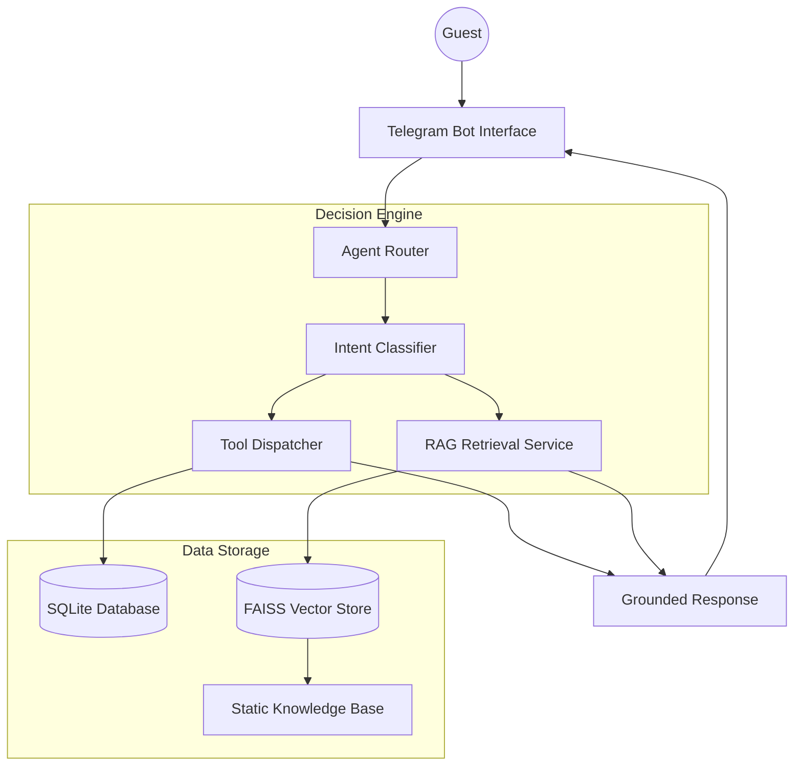

# Apollo Hotel AI Concierge System

## Overview

The Apollo Hotel AI Concierge is a production-ready, RAG-grounded customer support system designed for high-end hospitality environments. The system leverages the Gemini 2.0 Pro model to provide accurate, context-aware responses to guest inquiries via Telegram, integrating live database checks for room availability and food services with a comprehensive knowledge base for hotel policies and local area guidance.

## Architecture

The system utilizes a hybrid Retrieval-Augmented Generation (RAG) and tool-calling architecture to ensure responses are grounded in verified hotel data.



## System Components

### 1. Intent Classifier
Determines user intent from one of the following categories:
- GET_ROOMS: List available room types and pricing.
- RECOMMEND: Provide room suggestions based on budget.
- BOOK: Initiate the reservation process.
- ORDER_FOOD: Access the in-room dining system.
- GENERAL: Knowledge base inquiries (Wi-Fi, directions, policies).

### 2. Knowledge Base (RAG)
Stored in the static_data directory, the knowledge base contains Markdown-formatted policies and guides.
- Apollo_Hotel_KB: Core policies, services, and FAQ.
- Local_Area_Guide: Specific Hanoi 2026 intelligence (Xanh SM, Grab, safety).

### 3. Logic Layer
- llm_client.py: Handles model communication with built-in retry logic and embedding generation.
- agent_router.py: Orchestrates the flow between classification, tool execution, and RAG retrieval.
- ingest_kb.py: Automates the indexing of markdown files into the FAISS vector store.

## Installation and Deployment

### Prerequisites
- Python 3.10 or higher
- Docker and Docker Compose
- Gemini API Key
- Telegram Bot Token

### Local Setup
1. Clone the repository and navigate to the project root.
2. Create a .env file based on the provided .env.example.
3. Install dependencies:
   ```bash
   pip install -r requirements.txt
   ```
4. Initialize the database and knowledge base:
   ```bash
   python ai-agent-cs/backend/database/setup_db.py
   python ai-agent-cs/backend/data_scripts/ingest_kb.py
   ```
5. Start the Telegram bot:
   ```bash
   python ai-agent-cs/start_telegram_bot.py
   ```

### Docker Deployment
The system is optimized for containerized environments. To deploy:
```bash
docker build -t hotel-ai-agent ./ai-agent-cs
docker run -d --env-file .env hotel-ai-agent
```
The container uses entrypoint.sh to automatically verify database integrity and index the knowledge base on every startup.

## Development Standards
- All Knowledge Base modifications must be performed in the static_data/ directory.
- Pricing must adhere to the standardized Euro (€) format for consistency across documents.
- The use of emojis or non-text icons is strictly prohibited in professional documentation and system prompts.
