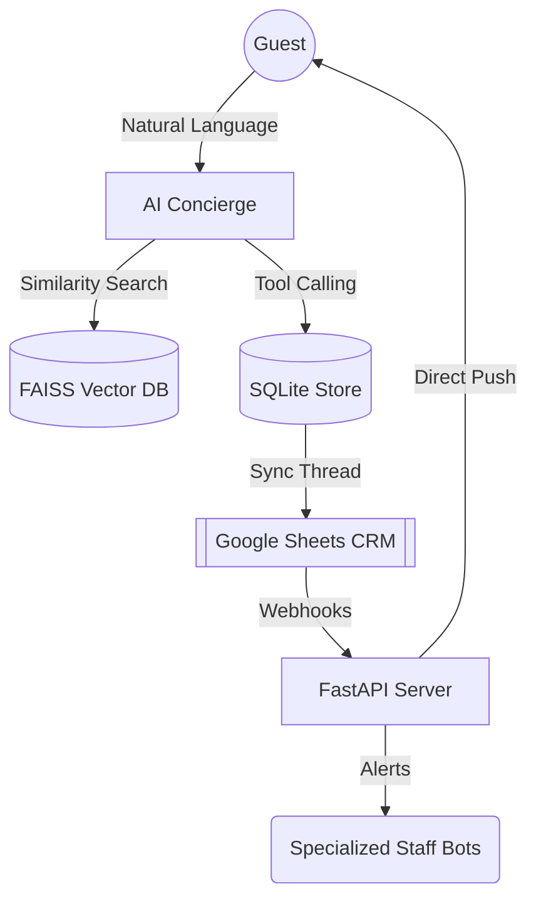

# 🏨 Apollo Hotel: Autonomous AI Concierge & RAG Orchestrator

[](https://www.docker.com/)
[](https://aistudio.google.com/)
[](https://ollama.com/)
[](https://telegram.org/)

The **Apollo Hotel AI Concierge** is a state-of-the-art, production-grade hospitality automation system. It transforms the guest experience through a hybrid architecture of **Retrieval-Augmented Generation (RAG)** and **Autonomous Tool-Calling**, grounded in real-time hotel data.

---

## 🌟 Core System Pillars

### 1. Autonomous Intent Capture (Direct-Catch)
Unlike traditional menu-driven bots, the Apollo Agent uses high-precision LLM reasoning to "catch" requests directly from casual chat. If a guest says, *"I need extra towels ASAP,"* the bot identifies the `SERVICE_REQUEST` intent, validates room ownership, and notifies the staff bot instantly.

### 2. Bi-Directional CRM Sync (2-Way CRM)
Your **Google Sheets** act as a live digital command center. 
- **Staff Control**: Updating a status in the spreadsheet (e.g., changing a booking to `CHECK_IN`) triggers an **instant push notification** to the guest's Telegram.
- **Agent Logging**: Every AI-captured request is synced to the cloud in milliseconds, ensuring absolute transparency.

### 3. "Tri-Bot" Multi-Staff Orchestration
The system orchestrates three specialized internal bots (+ the Guest Bot) to manage specific hotel departments:
- **🛎️ Front Desk Bot**: Registration and check-in updates.
- **🍳 Kitchen Admin Bot**: Milestone-driven order management (Recieved → Preparing → Delvering).
- **🛠️ Service/Maintenance Bot**: Real-time triage for guest housekeeping and maintenance needs.

### 4. Grounded RAG Intelligence
Using a **FAISS Vector Store** and Gemini embeddings, the agent provides hyper-accurate information on hotel policies, local area guides, and luxury service trivia, while strictly avoiding hallucinations.

---

## 🏗️ Architecture Overview



---

## 🚀 Getting Started

### Method A: Docker Compose (Professional Mode)
This is the recommended way to run the full ecosystem including the **Redis** persistence store.

1.  **Clone & Configure**:
    ```bash
    cp ai-agent-cs/.env.example ai-agent-cs/.env
    # Fill in your GEMINI_API_KEY and TELEGRAM_BOT_TOKEN
    ```
2.  **Start Services**:
    ```bash
    docker-compose up --build
    ```
    *Note: The system is pre-configured to find Ollama on your host machine via `host.docker.internal`.*

### Method B: Manual Setup (Local Development)
1.  **Install Dependencies**:
    ```bash
    pip install -r ai-agent-cs/requirements.txt
    ```
2.  **Initialize Infrastructure**:
    ```bash
    python ai-agent-cs/backend/database/setup_db.py
    python ai-agent-cs/backend/data_scripts/ingest_kb.py
    ```
3.  **Run the System**:
    - **Telegram Bot**: `python ai-agent-cs/start_telegram_bot.py`
    - **API Server**: `uvicorn ai-agent-cs.backend.api_server:app --port 8000`

---

## ⚙️ Configuration Standards

The system utilizes an **Aligned Environment Architecture**. Your `.env` and `.env.example` are mirrored for clarity:

| Section | Key Variables | Purpose |
| :--- | :--- | :--- |
| **Intelligence** | `GEMINI_API_KEY`, `OLLAMA_BASE_URL` | Cloud and Local LLM endpoints. |
| **Networking** | `API_BASE_URL`, `BACKEND_WEBHOOK_URL` | Links Google Sheets to your Local Bot. |
| **Persistence** | `REDIS_HOST`, `REDIS_PORT` | Manages high-speed session memory. |
| **Staff Bots** | `NOTIFY_BOOKING_TOKEN`, `NOTIFY_FOOD_TOKEN` | Tokens for the departmental staff bots. |

---

## 🛡️ "Zero-Configuration" Self-Healing
The system is built for resilience. During boot (via `entrypoint.sh`), it automatically:
- Checks for connection to the Redis memory store.
- Rebuilds the SQLite database if it's missing.
- Re-indexes the entire Knowledge Base into FAISS if no index is found.

---
**Apollo Hotel** — *Intelligent Hospitality, Powered by Agentic AI.*
